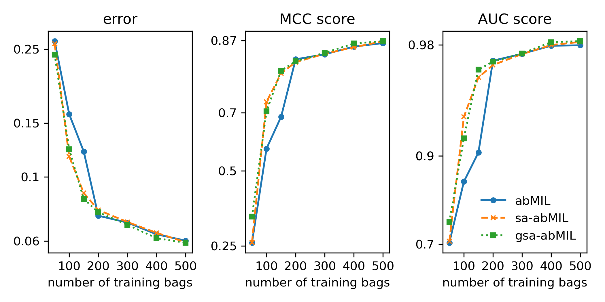

# Weakly-supervised classification - report

## How to use
`dataset.py`: contains the pytorch Dataset class generating MNIST bags dataset 

`model.py`: contains the main model class

`utils.py`: contains training, validation and testing functions

`main.py`: main script, it trains and tests a model (`model.py`) on a dataset (`dataset.py`) for a binary classification task.

`run_script.sh`: bash script for running all parameter configurations (model modes, number of bags, etc.) reported below

`plots.ipynb`: jupyter notebook with scripts for preparation of Figure 1 and Figure 2.

Code tested with:
* pytorch 1.13.1
* torchvision 0.14.1
* numpy 1.24.3
* scikit-learn 1.2.2
* matplotlib and jupyter notebook for creation of plots

## Dataset and classification task
The dataset contains bags of MNIST images (instances). The true label is assigned to a data point if the bag contains at least one number 7, otherwise the label is false. This is a synthetic problem that simulates more complex cases of, so-called, Multi-Instance Learning (MIL), where only one of the instances in a bag is associated with the bag's label. The classification task is among the simpler ones, there are more complex MIL problems based on _presence_ or _threshold_ labelling schemes. The model's objective is to perform binary bag classification.

## Model and classification methods

The presented model uses two pooling methods: attention-based MIL (abMIL) [1] and self-attention abMIL (sa-abMIL) [2].
Attention based MIL is a type of weighted average pooling where the neural network determines the weights of the instances in the bag. The abMIL method assumes that all instances in the bag are independent, which can be a disadvantage. This problem is solved by using an additional mechanism in the model: self-attention [2]. The self-attention abMIL (sa-abMIL) is based on an extra step that allows the model to find dependencies and similarities between the instances within the bag [2,3].

In this classification task, three modes od the model were used: one using only the abMIL approach, and two with the addition of a self-attention mechanism before pooling: using dot-product (sa-abMIL) and Gaussian kernel (gsa-abMIL). All approaches have already been successfully tested on a similar classification task using MNIST bags.

The first part of the model, a feature extractor, is a modified LeNet5 [4]. The model implementation, training, and testing procedures are derived from publicly available GitHub repositories linked to [1, 2]. 

## Experiment
We investigated how the number of bags in the training set affected the performance of the model on a large test set (1000 bags). The size of the bags was drawn from a normal distribution $N(10,2)$. 
Optimisation was done using the Adam optimiser, with parameters $\beta_1=0.9$, $\beta_2=0.999$, and a learning rate $10^{-5}$. All datasets used batch size 1. 
The training routines used early stopping based on the model's performance on a validation set (obtained via k-fold). All reported results are averaged over 5 random seeds. 

## Results and discussion

*Figure 1. Performance scores: error, Matthews Correlation Coefficient (MCC) and Area Under the RoC Curve (AUC) of the trained model versus number of training bags. The scores are computed using a large testing set (1000 bags) and averaged over 5 random seeds. For training sets $<200$ bags, the sa-abMIL  and gsa-abMIL perform better than the simpler abMIL model.*
Figure 1 shows three performance scores computed on the test set for all modes of the model. Except for the smallest training sets, the model performs the classification task relatively well. For intermediate training set sizes (100-200 bags), the sa-abMIL and gsa-abMIL methods give better results, but for larger training samples the differences are negligible. A greater difference in performance might be expected for a more complex classification task, e.g. presence of two 7s  or a combination of 7s and 9s in a bag. In this case self-attention should improve the performance of the model.

*Figure 2. Example of the instances for a synthetic test bag with two 7s shown with weights calculated by abMIL (upper black text) and gsa-abMIL (lower blue text) models trained on 150 bags. It can be seen that in the case of gsa-abMIL the second-largest weight for 7 is _strengthened_, similar to the observations presented in [2].*

Figure 2 shows an example of a bag consisting of 10 numbers, together with the instance weights returned by the model with (gsa-abMIL) and without (abMIL) self-attention. Similar to [2], self-attention leads to a strengthening of the important weight in the aggregation operator (see Fig. 2 for details).

Due to limited computational resources, an exhaustive optimisation of the hyperparameters was not performed. During the experiments their values were based on the information  available in [1, 2].

## References 
1. Maximilian Ilse, Jakub Tomczak, and Max Welling. “Attention-based deep multiple instance learning”. In: International conference on machine learning. PMLR. 2018, pp. 2127–2136.
2. Dawid Rymarczyk et al. “Kernel self-attention for weakly-supervised image classification using deep multiple instance learning”. In: Proceedings of the IEEE/CVF Winter Conference on Applications of Computer Vision. 2021, pp. 1721–1730.
3. Han Zhang et al. “Self-attention generative adversarial networks”. In: International conference on machine learning. PMLR. 2019, pp. 7354–7363.
4. Yann LeCun et al. “Gradient-based learning applied to document recognition”. In: Proceedings of the IEEE 86.11 (1998), pp. 2278–2324.
